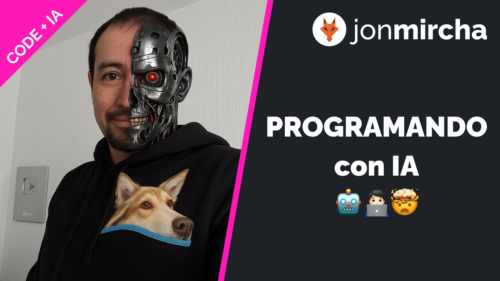

# Programando con IA 🤖

Hola soy tu amigo y docente artificial... Jonathan MirCha.

En este repositorio encontrarás el código fuente de aplicaciones que desarrollo con herramientas de Inteligencia Artificial.

La explicación y desarrollo de estos proyectos la encuentras en esta [lista de reproducción](https://www.youtube.com/playlist?list=PLvq-jIkSeTUZTQRwNFcJqHX9UzHJTvERx) de mi canal de _YouTube_.

## Episodios

1. _Vanilla Web App_ con _Supabase_
   - [Video](https://www.youtube.com/watch?v=IgU5kb399oI)
   - [Código](./01-my-todos-supabase/README.md)
1. _Vanilla Web App_ con _Firebase_
   - [Video](https://www.youtube.com/watch?v=iUKp-sZU6ss)
   - [Código](./02-my-todos-firebase/README.md)
